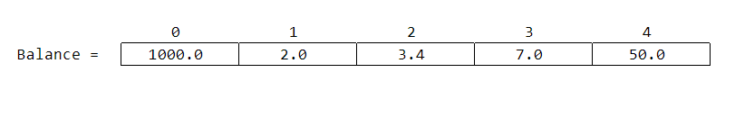

# Arrays in C Programming

[TOC]

## Introduction

A **data structure**, in general, is a data organization, management, and storage format that enables efficient access and modification.

A **data structure** is a particular way of organizing data in a computer so that it can be used effectively. There are several data structures that can be implemented or used.

**Arrays** are the most basic of data structure that can store a fixed-size, sequential collection of value of the same type. Each value stored in an array is called an element. An array is used to store a collection of data, but it is often more useful to think of an array as a collection of variables of the same type.

Instead of declaring individual variables, such as `number0`, `number1`, ..., and `number99`, you declare one array variable such as numbers and use `numbers[0]`, `numbers[1]`, and ..., `numbers[99]` to represent individual variables. This can save us time and also the effort to name and declare them.

> A specific element in an array is accessed by an index.

All arrays consist of contiguous memory locations. The lowest address corresponds to the first element and the highest address to the last element.

> Details on memory allocation and access will be discussed under `pointers`

---

## Declaring and Initializing arrays

### Declaring Arrays

Arrays can be declared by providing type, name and size.

**Syntax:**

```c
<type> arrayName[size];
```

**Eg:**

```c
int myArr[10];
```

> `size` should be greater than 0

---

### Initializing array

Arrays can be initialized using indices of element (discussed later) or direct assignment when declaring them.

**1. Providing Size and elements:**

```c
double balance[5] = {1000.0, 2.0, 3.4, 7.0, 50.0};
```

The number of values between braces `{}` cannot be larger than the number of elements that we declare for the array between square brackets `[]`.

**2. Providing only elements:**

```c
double balance[] = {1000.0, 2.0, 3.4, 7.0, 50.0};
```

If the size of the array is omitted, an array just big enough to hold the initialization is created.

---

### Assigning and getting elements using index

Index marks the positions of elements in arrays.

Consider the array `balance` as below:

```c
double balance[] = {1000.0, 2.0, 3.4, 7.0, 50.0};
```



The elements are indexed from `0` to `n - 1` where `n` is the number of elements in the array.

To access $\rm{k}^{th}$ element, we can use index $ = \rm{k}-1$ to access them.

**Syntax:**

```c
arrayName[index]
```

**Eg:** To get first element, $\rm{k} = 1$, $\rm{index} = 1-1$

```c
double val = balance[0];
// val contains 1000.0
```

Using assignment operator `=`, the element can be modified.

**Eg:**

```c
balance[1] = 10.0;
```

modifies balance to

```c
double balance[] = {1000.0, 10.0, 3.4, 7.0, 50.0};
```

---

## Input and Output in arrays

### Output - Printing Out arrays

Arrays can be printed out by use of loops

**Eg:**

```c
#include <stdio.h>

int main () {

   int n[15]; /* n is an array of 10 integers */
   int i, j;

   for(i = 0; i < 15; ++i) {
      n[i] = i + 200; /* set element at location i to i + 200 */
   }

   /* output each array element's value */
   for (j = 0; j < 15; ++j) {
      printf("Element[%d] = %d\n", j, n[j]);
   }

   return 0;
}
```

**Output:**

```txt
Element[0] = 200
Element[1] = 201
Element[2] = 202
Element[3] = 203
Element[4] = 204
Element[5] = 205
Element[6] = 206
Element[7] = 207
Element[8] = 208
Element[9] = 209
Element[10] = 210
Element[11] = 211
Element[12] = 212
Element[13] = 213
Element[14] = 214
```

---

### Input of arrays

Having known to assign values to arrays, it is easy to get input of arrays
**Syntax:**

```c
scanf("<format specifier>", &arrayName[index]);
```

**Eg:**

```c
#include <stdio.h>

int main () {

   int n[10]; /* n is an array of 10 integers */
   int i, j;

   /* input of array */
   for ( i = 0; i < 10; i++) {
      scanf("%d", &n[i]);
   }

   /* output each array element's value */
   for (j = 0; j < 10; j++) {
      printf("Element[%d] = %d\n", j, n[j]);
   }

   return 0;
}
```

**Input:**

```txt
10 20 30 40 50 60 70 80 90 100
```

**Output:**

```txt
Element[0] = 10
Element[1] = 20
Element[2] = 30
Element[3] = 40
Element[4] = 50
Element[5] = 60
Element[6] = 70
Element[7] = 80
Element[8] = 90
Element[9] = 100
```

---
