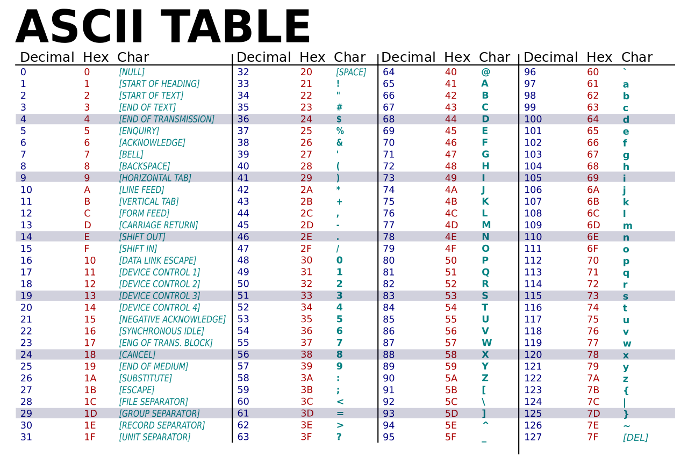

# Introduction to C - Part 1

## Introduction

### Program

A program is a set of instructions written on a computer to perform a specific task.

### Programming Language

Simply said, it is a language used to write a program.

It is a well defined medium to instruct the computer.

---

### Types of Programming Languages

Based on uses, the Programming languages can be classified under 50 types refer [List of Programming Languages by type](https://en.wikipedia.org/wiki/List_of_programming_languages_by_type)

Based on ease of readability:

1. Low-level Language - Assembly Language
2. Middle level Language - C, C++, etc.
3. High level Language - Python, java, Perl, etc.

Based on execution method:

1. Compiled Language
2. Interpreted Language

---

## Basic parts in programming

A few basic instructions that appear in almost all language (by [Allen Downey](https://en.wikipedia.org/wiki/Allen_Downey), in his book _How To Think Like A Computer Scientist_):

1. **Input:** Gather data from the keyboard, a file, or some other device.
2. **Output:** Display data on the screen or send data to a file or other device.
3. **Arithmetic:** Perform basic arithmetical operations like addition and multiplication
4. **Conditional Execution:** Check for certain conditions and execute the appropriate sequence of statements.
5. **Repetition:** Perform some action repeatedly, usually with some variation.

---

## Introduction to C programming

C is a general-purpose, procedural computer programming language supporting structured programming, with a static type system. In static type system, variables are defined to have only a specific type of data and cannot be assigned a different type of data.

By design, C provides constructs that map efficiently to typical machine instructions.

It is generally used to learn basic programming concepts. C language is being used to build other High level programming languages like python.  


---

## Basic Structure

```c
/**
* Basic Structure of a C program.
* It is the documentation section
*/

#include<stdio.h>

// definition and global declarations

int main(){
    //Declaration and Initialization
    //Statements
    return 0;
}
```

- The first few lines define what is called a documentation. This section contains a multi line comment describing the code. The details on comments are discussed below.

- Next is the link for the compiler to indicate header files that are being used from the library. **Header files** are documents that define the symbols that are used in the program. Here `stdio.h` header file is linked.

- The next section is the area of definition of constants and Global variables

- Below this is the area of code.

> The `main` function is the point of code at which execution of the program starts
>
> More details on `functions` will be discussed later.

## Data Types

Data can be defined as a representation of facts, concepts, or instructions in a formalized manner, which should be suitable for communication, interpretation, or processing by human or electronic machine.

Data type is an attribute which tells the compiler or interpreter how the programmer intends to use the data.

Basic Types:

1. Numeric:
   - Integer - 0, 2, 30
   - Float - 3.0, -0.0005 (single precision)
   - Double - 3.0, -0.00003 (double precision)
2. Boolean - `true` and `false`
3. Character - all symbols defined by ASCII
4. Null

**ASCII** - American Standard Code for Information Interchange



**Derived Data Types:**

1. Array
2. Strings
3. Structures
4. Unions
5. Enum
6. Pointers

Additional types in integers (Base):

1. Binary (base 2) [0,1]
2. Octal (base 8) [0-7]
3. Decimal (base 10) [0-9] Most Common
4. HexaDecimal (base 16) [0-9, A-F]

> `Derived` or `Non primitive` data types and the `types of integers` will be discussed later

---

## Literals

Literals are data that are directly used or processed in a program. If your program contains direct values like `10`, `3.14159`, `'a'` or `"str"`, they are known as literals

### Types of Identifiers

1. Constant - Values that do not change during the execution
2. Variable - Values that change

There are certain rules to be followed while naming an identifier:

1. Should start only with an alphabet or underscore (`'_'`) like a1, a2, \_name not 1a, 24c
2. Can contain characters defined in ASCII (alphabets and numbers) except ( &#36;, \\, /, etc.)
3. It should not be keyword
4. No spaces
5. Generally, uppercase alphabets are not used in the beginning of a variable name.

Naming Conventions: [Naming Convention - Wikipedia article](<https://en.wikipedia.org/wiki/Naming_convention_(programming)>)

For Easy readability:

<ul>
<li> Function or use as name</li>
<li> first letter in lowercase</li>
<li> If Name has Multiple words:</li>
  <ol>
  <li> Use underscore for space </li>
  <li> joint writing with words in Camel Case</li>
  </ol>
<li> Avoid Long names</li>
</ul>
Naming convention for multi word variable names:

1. Camel case (abcAbc) - `camelCase`
2. Pascal case (AbcAbc) - `PascalCase`
3. Screaming case (ABC) - `SCREAMINGCASE`
4. Lazy case (abc) - `lazycase`
5. Kebab case (ab-ab) - `kebab-case`
6. Snake case(ab_ab) - `snake_case`

> Of the above, the `camel` and `snake` cases are the most common ones

Eg.:

```txt
age, input_values, firstName, number, prime_num
```

Not this way:

```txt
user name, number_to_find_prime
```

[Variables (data type), Naming Convention](variable_name.c)

---

## Keywords or Reserved words

Words used for a special purpose in program.

E.g: `scanf`, `printf`, `int`, `if`, `for`, `try`, etc.

---

### Declaration vs Initialization of variables

**Declaration** is the process of defining the variables' or constants' names to be used in the program.

**Syntax:**

```c
<type> variableName;
```

> Multiple variables of same type can be declared on the same line, being separated be comma.

Eg:

```c
int age, num1;
char ch;
```

**Initialization** is the process of assigning values to the variables declared. It is done using assignment operator `=`. (For Details, check Assignment operators in [Part 2](<Intro_to_C(2).md>))

Eg:

```c
age = 10;
ch = 'a';
```

> Both Declaration and Initialization can be done in the same statement, for multiple variables

```c
int age = 20, num2 = 10;
char ch = 'z';
```

---

### Declaration of constants

In `C`, constants are declared and initialized in a single line using the `const` keyword. It is advised to have the constants' name in Uppercase.

**Syntax:**

```c
const <type> variable_name = <value>;
```

Eg:

```c
const int MY_CONSTANT = 10;
```

---

## Output handling or Printing out statements/Values to user

**Syntax:**

```c
printf("format specifier", identifier);
printf("statement");
```

### Format Specifiers

1. `%d` - integer (int)
2. `%f` - float
3. `%c` - character (char)
4. `%s` - string (str)
5. `%lf` - double

**Identifiers** - variables or expressions

[Writing your first Program - printing "Hello World"](Hello_world.c)

---

### Modifiers

Modifiers are key words that modify the default state of `int` and `char` data types. There are 4 modifiers in `C`:

1. short
2. long
3. signed
4. unsigned

**1. `short`:**

It limits user to store small integer values from `-32768` to `32767`. It can be used only on `int` data type.

```c
short int myShortInt = 10;
```

**2. `long`:**

It allows storage of large value than default limit for `int`. Tt can be use once or twice to mention the limits.

```c
long int myLongInt;
long myLongerInt;
long long myLongLongInt;
```

**3. `signed`:**

It is default modifier of `int` and `char` data type if no modifier is specified. It says that user can store negative and positive values.

```c
int myValue = -289;
signed int myValues = -544;
```

**4. `unsigned`:**

When user intends to store only positive values in the given data type (`int` and `char`).

```c
unsigned int myVal = 10;
```

To check the limitations of the modifiers, check [Part 3](<Intro_to_c(3).md>)

---

### List of Format specifiers

Having understood the modifiers in C, we can look at the complete list of format specifiers.

| Format Specifier       | Type                          |
| ---------------------- | ----------------------------- |
| `%c`                   | Character                     |
| `%d`                   | Signed integer                |
| `%e` or `%E`           | Scientific notation of floats |
| `%f`                   | Float values                  |
| `%g` or `%G`           | Similar as `%e` or `%E`       |
| `%hi`                  | Signed integer (`short`)      |
| `%hu`                  | Unsigned Integer (`short`)    |
| `%i`                   | Unsigned integer              |
| `%l` or `%ld` or `%li` | Long or `long int`            |
| `%lf`                  | Double                        |
| `%Lf`                  | Long double                   |
| `%lu`                  | Unsigned int or unsigned long |
| `%lli` or `%lld`       | Long long                     |
| `%llu`                 | Unsigned long long            |
| `%o`                   | Octal representation          |
| `%p`                   | Pointer                       |
| `%s`                   | String                        |
| `%u`                   | Unsigned int                  |
| `%x` or `%X`           | Hexadecimal representation    |
| `%n`                   | Prints nothing                |
| `%%`                   | Prints `%` character          |

These are the basic format specifiers. We can add some other parts with the format specifiers. These are like below −

- A minus symbol (`-`) sign tells left alignment

- A number after `%` specifies the minimum field width. If string is less than the width, it will be filled with spaces

- A period (`.`) is used to separate field width and precision

---

## Comments

Lines that are not executed. It used only for understanding by the programmers or users.

`//` is used to comment a single line

`/**/` - comment multiple lines

```c
// single line comment
/*
This is used to comment multiple lines
*/
```

[Next](<Intro_to_C(2).md>)
